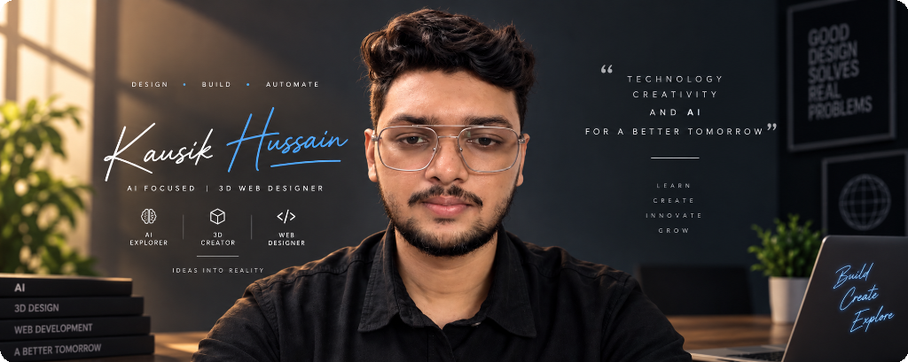
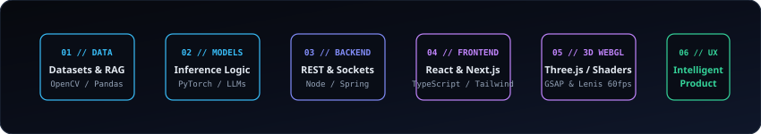
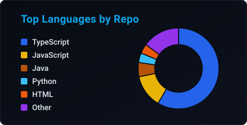
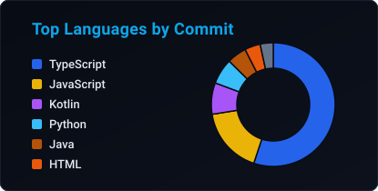
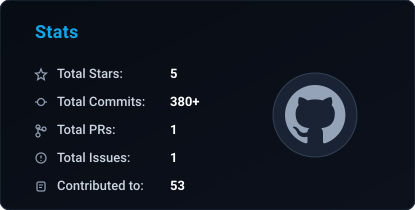
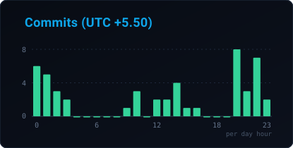

<div align="center">

  <!-- 01. MAIN HERO BANNER (PREMIUM CUSTOM PERSONAL IDENTITY) -->
  

  <br /><br />

  <!-- 02. ONE-LINE POSITIONING -->
  <p style="font-family: monospace; font-size: 13px; color: #38bdf8; letter-spacing: 2px; font-weight: 700; margin: 0 0 6px 0;">
    AI / ML &nbsp;·&nbsp; 3D WEB &nbsp;·&nbsp; FULL-STACK &nbsp;·&nbsp; CREATIVE ENGINEERING
  </p>
  <h3 style="color: #f1f5f9; letter-spacing: 1.2px; font-size: 16px; font-weight: 600; margin: 0 0 16px 0;">
    BUILDING INTELLIGENT SYSTEMS AND IMMERSIVE DIGITAL EXPERIENCES.
  </h3>

  <!-- 03. KEY ACTION LINKS -->
  <a href="https://kausik-portfolio-psi.vercel.app/" target="_blank">
    
  </a>
  &nbsp;
  <a href="https://linkedin.com/in/kausikhussain" target="_blank">
    
  </a>
  &nbsp;
  <a href="https://leetcode.com/u/Kausik_05/" target="_blank">
    
  </a>
  &nbsp;
  <a href="mailto:kausik1027@gmail.com" target="_blank">
    
  </a>

</div>

<br />

---

## 01 / ABOUT · THE DIGITAL LAB

<div align="center">
  <p style="font-family: monospace; font-size: 12.5px; color: #38bdf8; letter-spacing: 2px; font-weight: 700; margin: 0 0 6px 0;">
    // 01 : PERSONAL DIGITAL LABORATORY
  </p>
  <h2 style="color: #ffffff; letter-spacing: 1.2px; font-size: 22px; margin: 0 0 10px 0;">
    BUILDING AT THE INTERSECTION OF INTELLIGENCE, SYSTEMS &amp; INTERACTION.
  </h2>
  <p style="color: #94a3b8; font-size: 14.5px; max-width: 720px; line-height: 1.6; margin: 0 auto 16px auto;">
    I engineer software where <b>machine learning models</b>, <b>scalable backend microservices</b>, and <b>hardware-accelerated 3D WebGL scenes</b> converge into seamless, tactile digital products.
  </p>
</div>

<!-- SIGNATURE LAB ARCHITECTURAL NEXUS (100% RESPONSIVE REPO SVG) -->
<div align="center">
  
</div>

<br />

<table width="100%" border="0">
  <tr>
    <td bgcolor="#090d16" style="padding: 16px 20px; border-radius: 10px; border: 1px solid #1e293b;">
      <p style="color: #cbd5e1; font-size: 13.5px; line-height: 1.6; margin: 0;">
        💡 <b>WHAT THIS MEANS :</b> <i>I don't just build software. I build systems people can see, interact with, and experience — translating mathematical intelligence and GPU rendering into effortless user interfaces.</i>
      </p>
    </td>
  </tr>
</table>

<br />

---

## 02 / WHAT I BUILD

```
========================================================================================================
                                     DIGITAL LABORATORY DISCIPLINES
========================================================================================================

  ┌─────────────────────────────────┐       ┌─────────────────────────────────┐
  │  01. AI & INTELLIGENT SYSTEMS   │       │  02. 3D & SPATIAL EXPERIENCES   │
  │  ML · CV · LLM · Triage Engines │       │  Three.js · WebGL · GLSL Shaders│
  └─────────────────────────────────┘       └─────────────────────────────────┘
                   │                                         │
                   ▼                                         ▼
  ┌─────────────────────────────────┐       ┌─────────────────────────────────┐
  │  03. FULL-STACK DIGITAL PRODUCTS│       │  04. INTERACTION ENGINEERING    │
  │  Next.js · Node · Spring · DBs  │       │  GSAP · Lenis · 60fps Motion    │
  └─────────────────────────────────┘       └─────────────────────────────────┘
```

<table width="100%" border="0">
  <tr>
    <td width="25%" valign="top" bgcolor="#090d16" style="padding: 16px; border: 1px solid #1e293b; border-radius: 8px;">
      <h4 style="color: #38bdf8; margin: 0 0 8px 0;">01 // AI / INTELLIGENCE</h4>
      <p style="color: #cbd5e1; font-size: 13px; margin: 0 0 10px 0;">Machine learning pipelines, computer vision models, predictive algorithms, and custom LLM integrations.</p>
      <code style="color: #38bdf8; font-size: 11px;">PyTorch · OpenCV · RAG · Vision</code>
    </td>
    <td width="25%" valign="top" bgcolor="#090d16" style="padding: 16px; border: 1px solid #1e293b; border-radius: 8px;">
      <h4 style="color: #c084fc; margin: 0 0 8px 0;">02 // 3D / WEBGL</h4>
      <p style="color: #cbd5e1; font-size: 13px; margin: 0 0 10px 0;">Interactive Three.js scenes, custom GLSL shaders, camera physics, and scroll-driven cinematic choreography.</p>
      <code style="color: #c084fc; font-size: 11px;">Three.js · WebGL · GLSL · GSAP</code>
    </td>
    <td width="25%" valign="top" bgcolor="#090d16" style="padding: 16px; border: 1px solid #1e293b; border-radius: 8px;">
      <h4 style="color: #f43f5e; margin: 0 0 8px 0;">03 // FULL-STACK SYSTEMS</h4>
      <p style="color: #cbd5e1; font-size: 13px; margin: 0 0 10px 0;">Full-stack platforms with Next.js/React frontends, robust REST APIs, and high-concurrency microservices.</p>
      <code style="color: #f43f5e; font-size: 11px;">Next.js · Node.js · Spring · DBs</code>
    </td>
    <td width="25%" valign="top" bgcolor="#090d16" style="padding: 16px; border: 1px solid #1e293b; border-radius: 8px;">
      <h4 style="color: #34d399; margin: 0 0 8px 0;">04 // INTERACTION DESIGN</h4>
      <p style="color: #cbd5e1; font-size: 13px; margin: 0 0 10px 0;">Performance-first web interfaces with smooth micro-interactions, responsive grids, and luxury aesthetics.</p>
      <code style="color: #34d399; font-size: 11px;">Lenis · Framer · Tailwind · UX</code>
    </td>
  </tr>
</table>

<br />

---

## 03 / AI SYSTEMS LAB

```
========================================================================================================
                                     AI INFERENCE & DECISION PIPELINE
========================================================================================================

   [ 01. RAW DATA ]             [ 02. PRE-PROCESSING ]         [ 03. NEURAL COMPUTE ]        [ 04. DECISION API ]
  ┌─────────────────┐          ┌─────────────────────┐        ┌──────────────────────┐      ┌────────────────────┐
  │ Clinical Intake │ ───────► │ Feature Extraction  │ ─────► │ PyTorch / OpenCV     │ ───► │ Real-Time Triage   │
  │ & Video Feeds   │          │ & Token Normalizing │        │ Inference Pipeline   │      │ & Telemetry Stream │
  └─────────────────┘          └─────────────────────┘        └──────────────────────┘      └────────────────────┘
```

<table width="100%" border="0">
  <tr>
    <td width="50%" valign="top" bgcolor="#090d16" style="padding: 20px; border: 1px solid #1e293b; border-radius: 10px;">
      <h3 style="color: #38bdf8; margin: 0 0 10px 0;">🧠 MACHINE LEARNING &amp; PREDICTIVE ENGINES</h3>
      <p style="color: #94a3b8; font-size: 13px; line-height: 1.6;">
        Engineering applied machine learning architectures that translate multidimensional feature spaces into actionable, low-latency decisions.
      </p>
      <ul style="color: #cbd5e1; font-size: 13px; line-height: 1.7;">
        <li><b>Clinical Urgency Scoring:</b> ML-driven multi-symptom triage classification engine in <b>JanSehat</b>.</li>
        <li><b>Crowd Density Modeling:</b> Spatial computer vision analysis and predictive risk telemetry in <b>TechNova-S3</b>.</li>
        <li><b>High-Throughput ML Pipelines:</b> Automated model training, inference, and data telemetry in <b>Victus</b>.</li>
      </ul>
    </td>
    <td width="50%" valign="top" bgcolor="#090d16" style="padding: 20px; border: 1px solid #1e293b; border-radius: 10px;">
      <h3 style="color: #38bdf8; margin: 0 0 10px 0;">👁️ COMPUTER VISION &amp; LLM INTEGRATION</h3>
      <p style="color: #94a3b8; font-size: 13px; line-height: 1.6;">
        Bridging sensory inputs and contextual intelligence to build responsive, AI-augmented human interfaces.
      </p>
      <ul style="color: #cbd5e1; font-size: 13px; line-height: 1.7;">
        <li><b>Visual Feature Extraction:</b> Real-time frame processing, boundary segmentation, and telemetry via OpenCV.</li>
        <li><b>Contextual Retrieval (RAG):</b> Vector database indexing, semantic embeddings, and LLM response grounding.</li>
        <li><b>Edge Optimization:</b> Lightweight model quantization for sub-50ms inference on production web and mobile clients.</li>
      </ul>
    </td>
  </tr>
</table>

<br />

---

## 04 / 3D EXPERIENCE LAB

```
========================================================================================================
                                 SPATIAL GRAPHICS & 60FPS WEBGL PIPELINE
========================================================================================================

   [ 01. CAMERA ]               [ 02. GEOMETRY ]               [ 03. MATERIAL ]              [ 04. 60FPS FLOW ]
  ┌─────────────────┐          ┌─────────────────────┐        ┌──────────────────────┐      ┌────────────────────┐
  │ Viewport Orbit  │ ───────► │ 3D Mesh Instancing  │ ─────► │ Custom GLSL Shaders  │ ───► │ Lenis Smooth Scroll│
  │ & Damping Flow  │          │ & Buffer Attributes │        │ & PBR Lighting Math  │      │ & GSAP Choreography│
  └─────────────────┘          └─────────────────────┘        └──────────────────────┘      └────────────────────┘
```

<table width="100%" border="0">
  <tr>
    <td width="50%" valign="top" bgcolor="#090d16" style="padding: 20px; border: 1px solid #1e293b; border-radius: 10px;">
      <h3 style="color: #c084fc; margin: 0 0 10px 0;">🌐 WEBGL &amp; THREE.JS ARCHITECTURE</h3>
      <p style="color: #94a3b8; font-size: 13px; line-height: 1.6;">
        Transforming flat web pages into tactile, spatial experiences utilizing GPU hardware acceleration.
      </p>
      <ul style="color: #cbd5e1; font-size: 13px; line-height: 1.7;">
        <li><b>Interactive 3D Viewports:</b> Orbital camera physics with custom material reflectance and dynamic angle inspection in <b>VERON</b>.</li>
        <li><b>GLSL Fragment &amp; Vertex Shaders:</b> Atmospheric lighting, glass refraction, and particle field visualizers.</li>
        <li><b>GPU Draw-Call Optimization:</b> Mesh instancing, texture mipmapping, and lazy-loaded assets for zero jank.</li>
      </ul>
    </td>
    <td width="50%" valign="top" bgcolor="#090d16" style="padding: 20px; border: 1px solid #1e293b; border-radius: 10px;">
      <h3 style="color: #c084fc; margin: 0 0 10px 0;">🎬 MOTION DESIGN &amp; SCROLL PHYSICS</h3>
      <p style="color: #94a3b8; font-size: 13px; line-height: 1.6;">
        Creating seamless, synchronized interactions where user scroll gestures drive cinematic spatial camera paths.
      </p>
      <ul style="color: #cbd5e1; font-size: 13px; line-height: 1.7;">
        <li><b>Lenis Physics Integration:</b> Inertia-based smooth scrolling maintaining consistent velocity curves in <b>DriftX</b>.</li>
        <li><b>GSAP ScrollTrigger Choreography:</b> Multi-stage timeline pinning, split-text reveals, and continuous coordinate tracking.</li>
        <li><b>Framer Motion UI:</b> Dynamic layout transitions, modal drawers, and luxury micro-interactions.</li>
      </ul>
    </td>
  </tr>
</table>

<br />

---

## 05 / AI × 3D · THE SIGNATURE CONVERGENCE

<div align="center">
  
</div>

<br />

<table width="100%" border="0">
  <tr>
    <td bgcolor="#090d16" style="padding: 18px; border-radius: 10px; border: 1px solid #38bdf8;">
      <p style="color: #e2e8f0; font-size: 14px; line-height: 1.7; margin: 0;">
        Most developers specialize in <i>either</i> backend machine learning <i>or</i> creative frontend graphics. 
        <b>My core differentiator is unifying both</b>: building complex neural pipelines on the backend while rendering their outputs through bespoke, GPU-accelerated 3D WebGL spatial interfaces that feel effortless, tactile, and responsive.
      </p>
    </td>
  </tr>
</table>

<br />

---

## 06 / SELECTED WORK &amp; CASE STUDIES

<!-- HERO PROJECT 1: VERON -->
<table width="100%" border="0">
  <tr>
    <td bgcolor="#090d16" style="padding: 22px; border-radius: 12px; border: 1px solid #38bdf8;">
      <span style="color: #38bdf8; font-family: monospace; font-size: 11px; letter-spacing: 1.5px; font-weight: 700;">★ FEATURED BUILD 01 // 3D WEBGL &amp; LUXURY COMMERCE</span>
      <h2 style="color: #ffffff; margin: 8px 0 12px 0;">🛍️ VERON — Luxury Fashion &amp; 3D Web Experience</h2>
      <p style="color: #cbd5e1; font-size: 14px; line-height: 1.6;">
        <b>Problem &amp; Approach:</b> Traditional luxury retail web stores rely on flat 2D photography that fails to demonstrate product depth and fabric drape. VERON introduces an immersive 3D WebGL canvas engine allowing real-time garment rotation, material inspection, and seamless GSAP/Lenis scroll choreography.
      </p>
      <p><b>Architecture:</b> <code>Next.js</code> • <code>TypeScript</code> • <code>Three.js</code> • <code>WebGL</code> • <code>GSAP</code> • <code>Lenis Physics</code> • <code>Tailwind CSS</code> • <code>Framer Motion</code></p>
      <ul>
        <li>🌐 <b>Real-Time 3D Viewport:</b> Orbital camera physics with custom material reflectance and dynamic angle inspection.</li>
        <li>💫 <b>Cinematic Motion Choreography:</b> Scroll-triggered frame interpolations executing at a sustained 60fps.</li>
        <li>🛒 <b>Luxury Commerce UX:</b> Curated collection filtering, live INR cart drawers, and glassmorphic dialog interfaces.</li>
      </ul>
      <p>
        <a href="https://github.com/kausikhussain/VERON"><b>📁 Repository</b></a> &nbsp;|&nbsp;
        <a href="https://veron-drab.vercel.app"><b>🚀 Live Platform</b></a>
      </p>
    </td>
  </tr>
</table>

<br />

<!-- HERO PROJECT 2: JANSEHAT -->
<table width="100%" border="0">
  <tr>
    <td bgcolor="#090d16" style="padding: 22px; border-radius: 12px; border: 1px solid #c084fc;">
      <span style="color: #c084fc; font-family: monospace; font-size: 11px; letter-spacing: 1.5px; font-weight: 700;">★ FEATURED BUILD 02 // AI HEALTHCARE ARCHITECTURE · NATIONAL SIH FINALIST</span>
      <h2 style="color: #ffffff; margin: 8px 0 12px 0;">🏥 JanSehat — AI Clinical Triage &amp; Queue Management</h2>
      <p style="color: #cbd5e1; font-size: 14px; line-height: 1.6;">
        <b>Problem &amp; Approach:</b> High-volume hospital emergency rooms face critical delays during initial intake. JanSehat is a national SIH finalist platform engineered to automate patient symptom intake through machine learning triage scoring, routing patients by urgency and streaming appointments in real-time to physician consoles.
      </p>
      <p><b>Architecture:</b> <code>React</code> • <code>Node.js</code> • <code>Express</code> • <code>MongoDB</code> • <code>Python</code> • <code>Machine Learning Models</code> • <code>REST APIs</code></p>
      <ul>
        <li>🏆 <b>National Finalist Project:</b> Qualified among top nationwide engineering teams in the Smart India Hackathon.</li>
        <li>🤖 <b>Intelligent Triage Engine:</b> Multi-variable symptom evaluation predicting clinical urgency categories.</li>
        <li>📊 <b>Real-Time Physician Console:</b> Live appointment queue orchestration, patient records, and emergency alert telemetry.</li>
      </ul>
      <p>
        <a href="https://github.com/kausikhussain/Jansehat"><b>📁 Repository</b></a> &nbsp;|&nbsp;
        <a href="https://kausik-portfolio-psi.vercel.app/"><b>🚀 Project Showcase</b></a>
      </p>
    </td>
  </tr>
</table>

<br />

<!-- SECONDARY BUILDS GRID -->
<table width="100%" border="0">
  <tr>
    <!-- DriftX -->
    <td width="50%" valign="top" bgcolor="#090d16" style="padding: 18px; border: 1px solid #1e293b; border-radius: 8px;">
      <span style="color: #94a3b8; font-family: monospace; font-size: 11px; font-weight: 600;">03 // CREATIVE FRONTEND</span>
      <h3 style="color: #ffffff; margin: 6px 0 8px 0;">⚡ DriftX — Streetwear Landing Platform</h3>
      <p style="color: #cbd5e1; font-size: 13px;">Monochrome luxury streetwear platform featuring Lenis scroll physics, video-first hero sequences, and GSAP micro-interactions.</p>
      <p><code>Next.js</code> • <code>TypeScript</code> • <code>Tailwind</code> • <code>GSAP</code> • <code>Lenis</code></p>
      <p>
        <a href="https://github.com/kausikhussain/DriftX"><b>📁 Repository</b></a> &nbsp;|&nbsp;
        <a href="https://driftx-phi.vercel.app"><b>🚀 Live Demo</b></a>
      </p>
    </td>
    <!-- VeriomeX -->
    <td width="50%" valign="top" bgcolor="#090d16" style="padding: 18px; border: 1px solid #1e293b; border-radius: 8px;">
      <span style="color: #94a3b8; font-family: monospace; font-size: 11px; font-weight: 600;">04 // GENOMICS &amp; DECENTRALIZED DATA</span>
      <h3 style="color: #ffffff; margin: 6px 0 8px 0;">🧬 VeriomeX — Genomic Data Sovereignty</h3>
      <p style="color: #cbd5e1; font-size: 13px;">Privacy-preserving genomic data ecosystem combining IPFS decentralized storage, zero-knowledge proofs, and cryptographic access control.</p>
      <p><code>TypeScript</code> • <code>IPFS</code> • <code>Smart Contracts</code> • <code>ZK Proofs</code></p>
      <p>
        <a href="https://github.com/kausikhussain/VeriomeX-UI"><b>📁 Repository</b></a>
      </p>
    </td>
  </tr>
  <tr>
    <!-- TechNova-S3 -->
    <td width="50%" valign="top" bgcolor="#090d16" style="padding: 18px; border: 1px solid #1e293b; border-radius: 8px;">
      <span style="color: #94a3b8; font-family: monospace; font-size: 11px; font-weight: 600;">05 // AI CROWD SAFETY</span>
      <h3 style="color: #ffffff; margin: 6px 0 8px 0;">🛡️ TechNova-S3 — AI Crowd Safety System</h3>
      <p style="color: #cbd5e1; font-size: 13px;">AI-driven predictive crowd density analytics and real-time public safety alert system for smart city event management.</p>
      <p><code>Kotlin</code> • <code>Android</code> • <code>ML Models</code> • <code>REST APIs</code></p>
      <p>
        <a href="https://github.com/kausikhussain/TechNova-S3"><b>📁 Repository</b></a>
      </p>
    </td>
    <!-- FreshKart -->
    <td width="50%" valign="top" bgcolor="#090d16" style="padding: 18px; border: 1px solid #1e293b; border-radius: 8px;">
      <span style="color: #94a3b8; font-family: monospace; font-size: 11px; font-weight: 600;">06 // QUICK-COMMERCE ENGINE</span>
      <h3 style="color: #ffffff; margin: 6px 0 8px 0;">🛒 FreshKart — Hyperlocal Delivery Platform</h3>
      <p style="color: #cbd5e1; font-size: 13px;">Production-ready grocery delivery platform engineered for ultra-fast local fulfillment, dynamic cart state, and order tracking.</p>
      <p><code>Next.js</code> • <code>TypeScript</code> • <code>Tailwind</code> • <code>Node.js</code></p>
      <p>
        <a href="https://github.com/kausikhussain/FreshKart"><b>📁 Repository</b></a>
      </p>
    </td>
  </tr>
</table>

<br />

---

## 07 / ENGINEERING STACK &amp; CAPABILITY MAP

<div align="center">
  
</div>

<br />

<div align="center">

<table width="100%" border="0">
  <tr>
    <td width="22%" align="right" bgcolor="#090d16" style="padding: 12px 16px; border: 1px solid #1e293b;"><b style="color: #38bdf8;">AI &amp; INTELLIGENCE</b></td>
    <td bgcolor="#0b0f19" style="padding: 12px 16px; border: 1px solid #1e293b;">
      <code>Python</code> &nbsp;·&nbsp; <code>PyTorch</code> &nbsp;·&nbsp; <code>TensorFlow</code> &nbsp;·&nbsp; <code>OpenCV</code> &nbsp;·&nbsp; <code>Computer Vision</code> &nbsp;·&nbsp; <code>LLMs &amp; RAG</code> &nbsp;·&nbsp; <code>Scikit-Learn</code>
    </td>
  </tr>
  <tr>
    <td width="22%" align="right" bgcolor="#090d16" style="padding: 12px 16px; border: 1px solid #1e293b;"><b style="color: #c084fc;">3D &amp; CREATIVE WEB</b></td>
    <td bgcolor="#0b0f19" style="padding: 12px 16px; border: 1px solid #1e293b;">
      <code>Three.js</code> &nbsp;·&nbsp; <code>WebGL 2.0</code> &nbsp;·&nbsp; <code>GSAP ScrollTrigger</code> &nbsp;·&nbsp; <code>Lenis Smooth Scroll</code> &nbsp;·&nbsp; <code>Framer Motion</code> &nbsp;·&nbsp; <code>GLSL Shaders</code>
    </td>
  </tr>
  <tr>
    <td width="22%" align="right" bgcolor="#090d16" style="padding: 12px 16px; border: 1px solid #1e293b;"><b style="color: #38bdf8;">FRONTEND ECOSYSTEM</b></td>
    <td bgcolor="#0b0f19" style="padding: 12px 16px; border: 1px solid #1e293b;">
      <code>Next.js 14/15 (App Router)</code> &nbsp;·&nbsp; <code>React 18/19</code> &nbsp;·&nbsp; <code>TypeScript</code> &nbsp;·&nbsp; <code>Tailwind CSS</code> &nbsp;·&nbsp; <code>HTML5 Canvas</code>
    </td>
  </tr>
  <tr>
    <td width="22%" align="right" bgcolor="#090d16" style="padding: 12px 16px; border: 1px solid #1e293b;"><b style="color: #f43f5e;">BACKEND &amp; SYSTEMS</b></td>
    <td bgcolor="#0b0f19" style="padding: 12px 16px; border: 1px solid #1e293b;">
      <code>Node.js</code> &nbsp;·&nbsp; <code>Express.js</code> &nbsp;·&nbsp; <code>Spring Boot</code> &nbsp;·&nbsp; <code>Java</code> &nbsp;·&nbsp; <code>REST APIs</code> &nbsp;·&nbsp; <code>C++</code> &nbsp;·&nbsp; <code>Kotlin</code>
    </td>
  </tr>
  <tr>
    <td width="22%" align="right" bgcolor="#090d16" style="padding: 12px 16px; border: 1px solid #1e293b;"><b style="color: #34d399;">DATA &amp; INFRASTRUCTURE</b></td>
    <td bgcolor="#0b0f19" style="padding: 12px 16px; border: 1px solid #1e293b;">
      <code>MongoDB</code> &nbsp;·&nbsp; <code>PostgreSQL</code> &nbsp;·&nbsp; <code>MySQL</code> &nbsp;·&nbsp; <code>Docker</code> &nbsp;·&nbsp; <code>Git &amp; GitHub Actions</code> &nbsp;·&nbsp; <code>Vercel</code> &nbsp;·&nbsp; <code>Figma</code>
    </td>
  </tr>
</table>

</div>

<br />

---

## 08 / ENGINEERING PRINCIPLES

<table width="100%" border="0">
  <tr>
    <td width="25%" bgcolor="#090d16" style="padding: 16px; border: 1px solid #1e293b; border-radius: 8px;">
      <b style="color: #38bdf8;">01 / PERFORMANCE IS A FEATURE</b>
      <p style="color: #94a3b8; font-size: 12.5px; margin: 6px 0 0 0;">Speed is non-negotiable. Sub-100ms API response rates and zero-jank WebGL rendering define luxury software.</p>
    </td>
    <td width="25%" bgcolor="#090d16" style="padding: 16px; border: 1px solid #1e293b; border-radius: 8px;">
      <b style="color: #c084fc;">02 / INTELLIGENCE OVER COMPLEXITY</b>
      <p style="color: #94a3b8; font-size: 12.5px; margin: 6px 0 0 0;">Solve hard problems with architectural clarity rather than convoluted layers. Simplicity scales.</p>
    </td>
    <td width="25%" bgcolor="#090d16" style="padding: 16px; border: 1px solid #1e293b; border-radius: 8px;">
      <b style="color: #f43f5e;">03 / DESIGN × ENGINEERING</b>
      <p style="color: #94a3b8; font-size: 12.5px; margin: 6px 0 0 0;">Design before code. Every transition, shader, and layout choice serves user intuition and visual delight.</p>
    </td>
    <td width="25%" bgcolor="#090d16" style="padding: 16px; border: 1px solid #1e293b; border-radius: 8px;">
      <b style="color: #34d399;">04 / BUILD TO REMEMBER</b>
      <p style="color: #94a3b8; font-size: 12.5px; margin: 6px 0 0 0;">Create digital experiences that leave a lasting impression. Quality craftsmanship is immediately felt.</p>
    </td>
  </tr>
</table>

<br />

---

## 09 / MILESTONES &amp; RECOGNITION

<table width="100%" border="0">
  <tr>
    <td width="33%" bgcolor="#090d16" style="padding: 18px; border: 1px solid #1e293b; border-radius: 8px;" align="center">
      <h3 style="color: #fbbf24; margin: 0 0 6px 0;">🏆 SIH FINALIST</h3>
      <p style="color: #e2e8f0; font-size: 13px; margin: 0;"><b>Smart India Hackathon</b></p>
      <p style="color: #94a3b8; font-size: 12px; margin: 4px 0 0 0;">National Finalist with <b>JanSehat</b> AI healthcare triage architecture.</p>
    </td>
    <td width="33%" bgcolor="#090d16" style="padding: 18px; border: 1px solid #1e293b; border-radius: 8px;" align="center">
      <h3 style="color: #38bdf8; margin: 0 0 6px 0;">🚀 50+ REPOSITORIES</h3>
      <p style="color: #e2e8f0; font-size: 13px; margin: 0;"><b>Active Open Source</b></p>
      <p style="color: #94a3b8; font-size: 12px; margin: 4px 0 0 0;">Continuous engineering across AI, full-stack, and 3D web systems.</p>
    </td>
    <td width="33%" bgcolor="#090d16" style="padding: 18px; border: 1px solid #1e293b; border-radius: 8px;" align="center">
      <h3 style="color: #34d399; margin: 0 0 6px 0;">⚡ PRODUCTION APPS</h3>
      <p style="color: #e2e8f0; font-size: 13px; margin: 0;"><b>Live Deployments</b></p>
      <p style="color: #94a3b8; font-size: 12px; margin: 4px 0 0 0;">Maintaining verified high-performance production web platforms on Vercel.</p>
    </td>
  </tr>
</table>

<br />

---

## 10 / ENGINEERING ACTIVITY &amp; TELEMETRY

<div align="center">

  <p>
    <kbd style="background-color: #080c14; color: #38bdf8; border: 1px solid #1e293b; padding: 4px 12px; font-family: monospace; font-size: 13px; font-weight: 600;">~$ ./telemetry --target kausikhussain</kbd>
  </p>

  <br />

  <!-- ROW 1: TOTAL CONTRIBUTIONS, CURRENT STREAK, LONGEST STREAK -->
  

  <br /><br />

  <!-- ROW 2: TOP LANGUAGES (BY REPO & BY COMMIT) -->
  <table width="100%" border="0" cellpadding="0" cellspacing="8">
    <tr>
      <td width="50%" valign="top">
        
      </td>
      <td width="50%" valign="top">
        
      </td>
    </tr>
  </table>

  <br />

  <!-- ROW 3: STATS & COMMITS BY HOUR (UTC +5:30) -->
  <table width="100%" border="0" cellpadding="0" cellspacing="8">
    <tr>
      <td width="50%" valign="top">
        
      </td>
      <td width="50%" valign="top">
        
      </td>
    </tr>
  </table>

  <br /><br />

  <!-- 3D ISOMETRIC CONTRIBUTION GRID SNAKE -->
  

  <br /><br />

  <!-- LIVE GITHUB ACTION CONTRIBUTION SNAKE -->
  <picture>
    <source media="(prefers-color-scheme: dark)" srcset="https://raw.githubusercontent.com/kausikhussain/kausikhussain/output/github-contribution-grid-snake-dark.svg">
    <source media="(prefers-color-scheme: light)" srcset="https://raw.githubusercontent.com/kausikhussain/kausikhussain/output/github-contribution-grid-snake.svg">
    
  </picture>

</div>

<br />

---

## 11 / PROBLEM SOLVING &amp; ALGORITHMS

<div align="center">
  <a href="https://leetcode.com/u/Kausik_05/" target="_blank">
    
  </a>
</div>

<br />

---

## 12 / KAUSIK LAB · ACTIVE EXPLORATIONS

```python
# ==============================================================================
# KAUSIK LAB — ACTIVE RESEARCH & EXPERIMENTAL PIPELINES
# ==============================================================================

active_explorations = {
    "01_webgl_latent_visualizer": {
        "domain": "3D Graphics × AI",
        "description": "Interactive WebGL 3D latent-space visualizer using custom GLSL shaders.",
        "status": "ACTIVE 🔬",
    },
    "02_low_latency_clinical_triage": {
        "domain": "Applied Machine Learning",
        "description": "Optimizing sub-50ms inference latency for hospital intake classification models.",
        "status": "ACTIVE ⚡",
    },
    "03_spatial_product_customizer": {
        "domain": "Three.js / WebGL",
        "description": "Physics-based 3D mesh inspection with real-time procedural texture mapping.",
        "status": "BUILDING 🚀",
    },
    "04_distributed_backend_concurrency": {
        "domain": "Systems Architecture",
        "description": "Distributed Spring Boot microservice architectures with Redis caching layers.",
        "status": "EXPERIMENTING 📈",
    },
}
```

<br />

---

## 13 / LET'S BUILD SOMETHING EXTRAORDINARY

<div align="center">

  <p style="font-family: monospace; font-size: 13px; color: #a78bfa; letter-spacing: 2px; font-weight: 700;">
    BUILDING AT THE INTERSECTION OF
  </p>
  <h2 style="color: #ffffff; letter-spacing: 3px; margin: 4px 0 20px 0;">
    AI &nbsp;×&nbsp; SYSTEMS &nbsp;×&nbsp; 3D &nbsp;×&nbsp; DESIGN
  </h2>

  <br />

  <a href="https://kausik-portfolio-psi.vercel.app/" target="_blank">
    
  </a>
  &nbsp;
  <a href="https://linkedin.com/in/kausikhussain" target="_blank">
    
  </a>
  &nbsp;
  <a href="mailto:kausik1027@gmail.com" target="_blank">
    
  </a>
  &nbsp;
  <a href="https://leetcode.com/u/Kausik_05/" target="_blank">
    
  </a>

  <br /><br /><br />

  <!-- Footer Banner -->
  

  <p style="color: #64748b; font-size: 12px; margin-top: 8px;">
    <i>Designed &amp; Engineered with precision by <b>Kausik Hussain</b> &nbsp;·&nbsp; Build. Experiment. Evolve.</i>
  </p>

</div>
