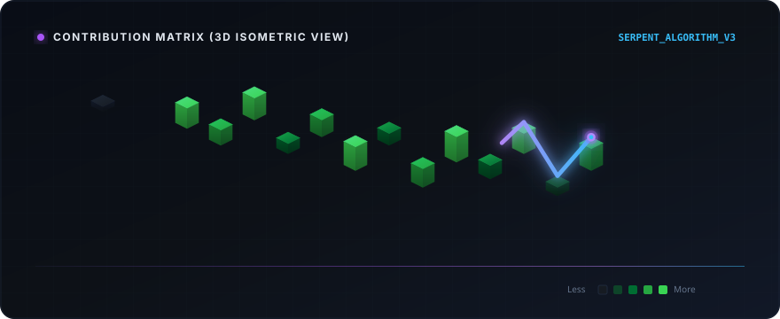

  <!-- Hero Banner -->
  

    

  <!-- Profile Views & Status Pill Badges -->
  
  &nbsp;
  

    

  <!-- Animated Typing SVG Header -->
  

 

---

## ⚡ Executive Summary

<table width="100%">
  <tr>
    <td width="100%" bgcolor="#0b0f19">
       
      

        I am a <b>Full-Stack Developer, AI/ML Enthusiast, and 3D Web Experience Engineer</b> dedicated to building luxury-grade, high-performance digital products. My work bridges complex artificial intelligence models, robust backend architectures, and fluid, interactive 3D web interfaces.
      

      <ul>
        <li>🧠 <b>Artificial Intelligence &amp; ML:</b> Designing intelligent pipelines, computer vision systems, and LLM integrations.</li>
        <li>🎨 <b>Frontend &amp; 3D Graphics:</b> Sculpting 60fps web experiences using React, Next.js, Three.js, GSAP, and Framer Motion.</li>
        <li>⚡ <b>Backend Systems &amp; APIs:</b> Engineering resilient, scalable services with Node.js, Express, Spring Boot, and modern databases.</li>
        <li>💎 <b>Design &amp; Craftsmanship:</b> Creating minimal, functional, and visually striking interfaces inspired by top-tier product design.</li>
      </ul>
       
    </td>
  </tr>
</table>

 

---

## 🛠️ Tech Stack & Ecosystem

### 🎨 Frontend & 3D Web Graphics

  
  
  
  
  
  
  

### ⚡ Backend & System Architecture

  
  
  
  

### 🧠 AI & Machine Learning

  
  
  
  
  

### 🗄️ Databases & Storage

  
  
  

### 💻 Core Programming Languages

  
  
  
  
  

### 🛠️ Infrastructure & Design Tools

  
  
  
  
  

 

---

## 🌟 Flagship Projects

<table width="100%">
  <!-- Project 1: Drift -->
  <tr>
    <td width="50%" valign="top">
      <h3>🛍️ Drift — Ultra-Premium E-Commerce Platform</h3>
      
A flagship, luxury e-commerce web application with dynamic animations, multi-filter engines, wishlist &amp; cart slide-over drawers, and responsive product dialogs.

      
<b>Tech Stack:</b> <code>Next.js 14</code> • <code>TypeScript</code> • <code>Tailwind CSS</code> • <code>Framer Motion</code>

      <ul>
        <li>✨ Gender collection segregation &amp; multi-parameter filter engine.</li>
        <li>🛒 Live INR cart drawer with threshold progress bar.</li>
        <li>🔍 Quick View modal dialogs &amp; toast notification manager.</li>
      </ul>
      

        <a href="https://github.com/kausikhussain/drift"><b>📁 Repository</b></a> &nbsp;|&nbsp; 
        <a href="https://kausik-portfolio-psi.vercel.app/"><b>🚀 Live Demo</b></a>
      

    </td>
    <!-- Project 2: JanSehat -->
    <td width="50%" valign="top">
      <h3>🏥 JanSehat — AI Healthcare &amp; Patient Management</h3>
      
<b>Smart India Hackathon Finalist Project</b> — An intelligent healthcare platform simplifying clinical workflows, automated patient triage, and real-time medical diagnostics.

      
<b>Tech Stack:</b> <code>React</code> • <code>Node.js</code> • <code>Express</code> • <code>MongoDB</code> • <code>ML Models</code>

      <ul>
        <li>🏆 National SIH Finalist solution for public health management.</li>
        <li>🤖 Automated AI symptom analysis &amp; triage assignment.</li>
        <li>📊 Doctor dashboard &amp; real-time appointment queueing.</li>
      </ul>
      

        <a href="https://github.com/kausikhussain/jansehat"><b>📁 Repository</b></a> &nbsp;|&nbsp; 
        <a href="https://kausik-portfolio-psi.vercel.app/"><b>🚀 Project Showcase</b></a>
      

    </td>
  </tr>
  <!-- Project 3: Victus & Project 4: 3D Portfolio -->
  <tr>
    <td width="50%" valign="top">
      <h3>⚡ Victus — AI-Driven Full-Stack Application</h3>
      
An intelligent web ecosystem engineered for automated data processing, machine learning predictions, and high-concurrency API handling.

      
<b>Tech Stack:</b> <code>Python</code> • <code>PyTorch</code> • <code>React</code> • <code>REST APIs</code> • <code>Tailwind CSS</code>

      <ul>
        <li>🧠 Automated machine learning model execution.</li>
        <li>📈 Interactive analytics dashboards and real-time visualizers.</li>
        <li>⚡ Optimized backend API response rates under heavy load.</li>
      </ul>
      

        <a href="https://github.com/kausikhussain/victus"><b>📁 Repository</b></a> &nbsp;|&nbsp; 
        <a href="https://kausik-portfolio-psi.vercel.app/"><b>🚀 Live Demo</b></a>
      

    </td>
    <td width="50%" valign="top">
      <h3>✨ 3D Interactive Portfolio — Luxury Web Experience</h3>
      
A web experience pushing the boundaries of browser capabilities with 3D canvas shaders, smooth scroll triggers, and fluid micro-animations.

      
<b>Tech Stack:</b> <code>Next.js</code> • <code>Three.js</code> • <code>GSAP</code> • <code>Framer Motion</code> • <code>Tailwind CSS</code>

      <ul>
        <li>🌐 Interactive WebGL 3D models and dynamic camera controls.</li>
        <li>💫 Glassmorphic dark layout with responsive grid mechanics.</li>
        <li>⚡ Perfect performance score with lazy-loaded 3D assets.</li>
      </ul>
      

        <a href="https://github.com/kausikhussain"><b>📁 Repository</b></a> &nbsp;|&nbsp; 
        <a href="https://kausik-portfolio-psi.vercel.app/"><b>🚀 Explore Portfolio</b></a>
      

    </td>
  </tr>
</table>

 

---

## 🐍 3D Isometric Contribution Grid & Snake Animation

  <!-- Bespoke 3D Isometric Vector Snake Visualization -->
  

    

  <!-- Live GitHub Action Output Snake Animation (Electric Purple Accent) -->
  <picture>
    <source media="(prefers-color-scheme: dark)" srcset="https://raw.githubusercontent.com/kausikhussain/kausikhussain/output/github-contribution-grid-snake-dark.svg">
    <source media="(prefers-color-scheme: light)" srcset="https://raw.githubusercontent.com/kausikhussain/kausikhussain/output/github-contribution-grid-snake.svg">
    
  </picture>

 

---

## 📊 Analytics, Problem Solving & Activity

  <table border="0">
    <tr>
      <td>
        
      </td>
      <td>
        
      </td>
    </tr>
  </table>

   

  <!-- LeetCode Problem Solving Widget & Streak -->
  <table border="0">
    <tr>
      <td>
        
      </td>
      <td>
        
      </td>
    </tr>
  </table>

   

  <!-- Activity Graph -->
  

 

---

## 🏆 Key Achievements & Recognition

- **🏆 Smart India Hackathon (SIH) Finalist**: Qualified among top nationwide development teams with **JanSehat**, building scalable healthcare AI architecture.
- **🚀 Flagship Full-Stack Engineering**: Built and published production-grade web platforms including **Drift** and **Victus**.
- **🎨 3D Web & UI Excellence**: Crafted immersive 60fps web graphics and modern design systems using **Three.js**, **GSAP**, and **Framer Motion**.
- **🌐 Active Open Source Contributor**: Continuously contributing to scalable web software, developer tools, and machine learning repositories.

 

---

## 🎯 Current Focus & Development Philosophy

<table width="100%">
  <tr>
    <td width="50%" valign="top">
      <h3>🚀 Currently Mastering</h3>
      <ul>
        <li>⚡ <b>Advanced Java Architecture:</b> Distributed systems, concurrency, and high-performance JVM optimization.</li>
        <li>🧠 <b>AI &amp; Deep Learning:</b> Advanced LLM fine-tuning, RAG architectures, and computer vision pipelines.</li>
        <li>🏗️ <b>System Design:</b> Event-driven microservices, caching layers, and database scaling.</li>
        <li>🎨 <b>3D Web Graphics:</b> WebGL shaders, GLSL, and complex Three.js scene graphs.</li>
      </ul>
    </td>
    <td width="50%" valign="top">
      <h3>💎 Development Philosophy</h3>
      <ol>
        <li><b>Build with Purpose</b> — Form follows function; software must solve real problems elegantly.</li>
        <li><b>Design Before Code</b> — Exceptional UX starts with deliberate UI/UX architecture.</li>
        <li><b>Performance First</b> — Smooth 60fps rendering and instant response times are mandatory.</li>
        <li><b>Simplicity Scales</b> — Clean, modular code beats complex over-engineering every time.</li>
      </ol>
    </td>
  </tr>
</table>

 

---

## 🎧 Developer Vibe & Beyond The Code

  <table width="100%">
    <tr>
      <td width="50%" align="center">
        <h4>🎵 Coding Vibe &amp; Audio Pulse</h4>
        
☕ <b>Single-Origin Espresso</b> &nbsp;•&nbsp; 🎧 <b>Synthwave / Ambient Lo-Fi</b>

        
<i>"Code in silence, let execution make the noise."</i>

      </td>
      <td width="50%" align="center">
        <h4>💡 Developer Mindset</h4>
        <blockquote>
          "I don't just write code; I design digital experiences that feel alive."
        </blockquote>
      </td>
    </tr>
  </table>

 

---

## 📬 Connect With Me

  
  &nbsp;
  
  &nbsp;
  
  &nbsp;
  
  &nbsp;
  
  &nbsp;
  

    

  <!-- Footer Banner -->
  

  
<i>Crafted with precision &amp; passion by <b>Kausik Hussain</b></i>

